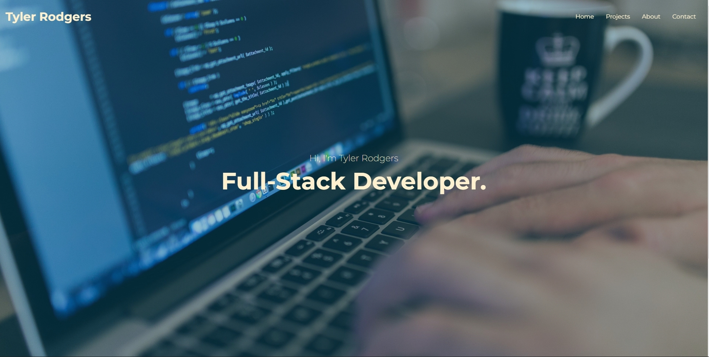

# Tyler Rodgers React Portfolio
  

  
  ## Description 
  This Project is a SPA made through react.js. Content will dynamically render on the page as you navigate through the 'Home', 'Projects', 'Aboout' and 'Contact' tabs. 

  ## Table of Contents
  * [Usage](#usage)
  * [License](#license)
  * [Questions](#questions)
  
  ## Usage 
  Allows users to view an about me page, see my previous projects, download my resume, and contact me via email. View the deployed application [here.](http://TSRodgers.github.io/react-portfolio)
  

  ## License 
  This project is license under MIT

  ## Questions
  If you have any questions about this projects, please contact me directly at tyler.rodgers74@gmail.com. You can view more of my projects at https://github.com/TSRodgers.
